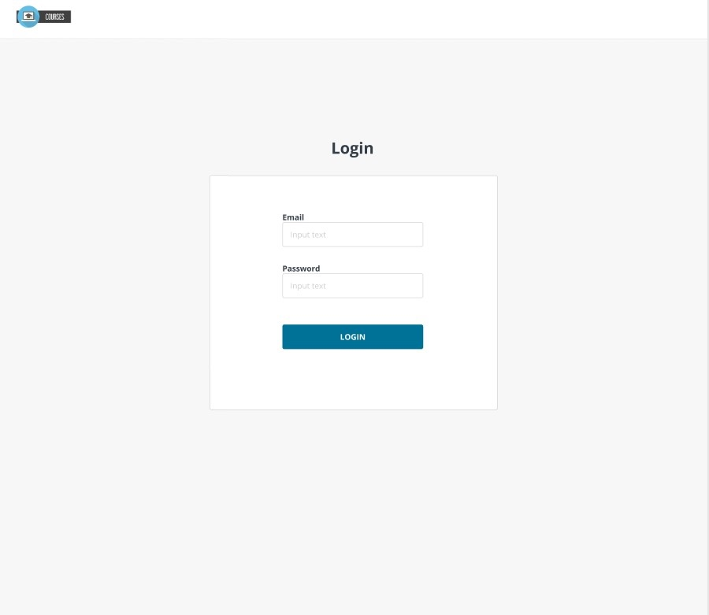
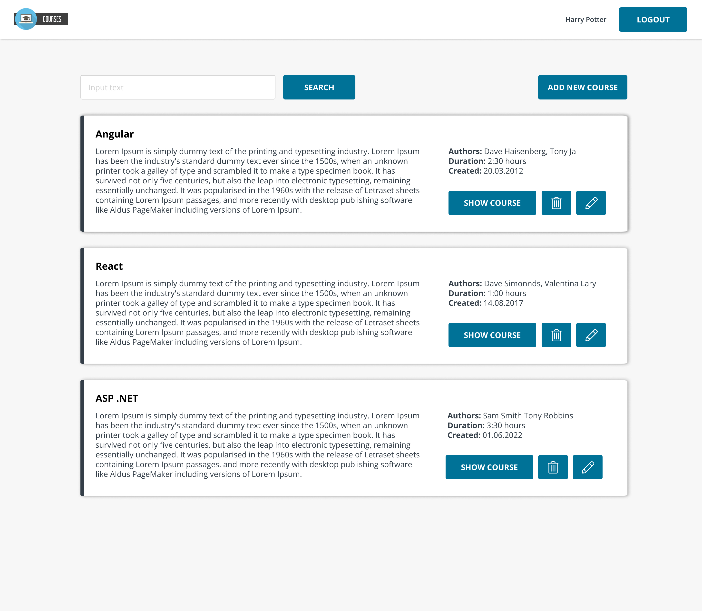
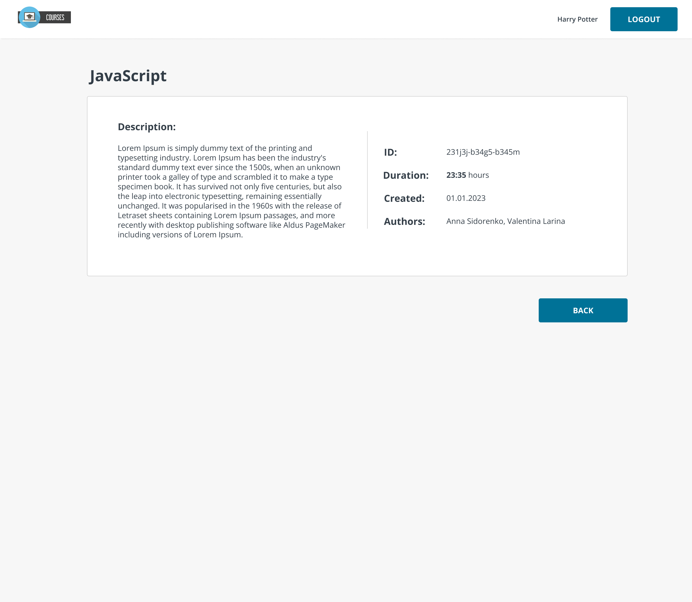
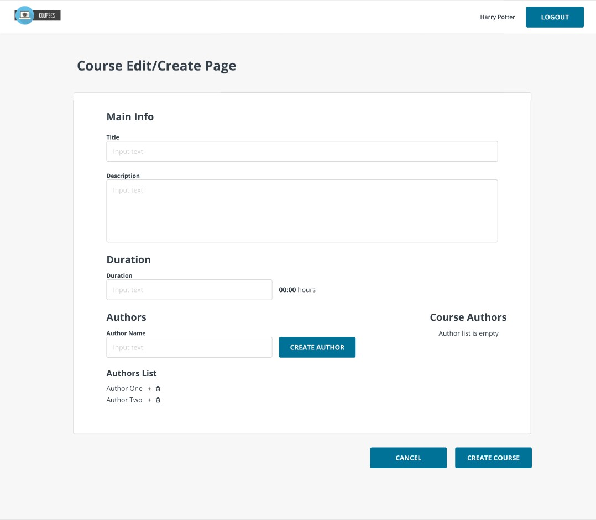
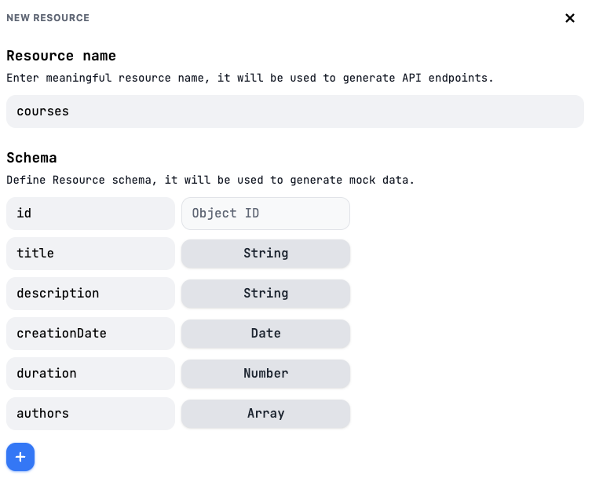
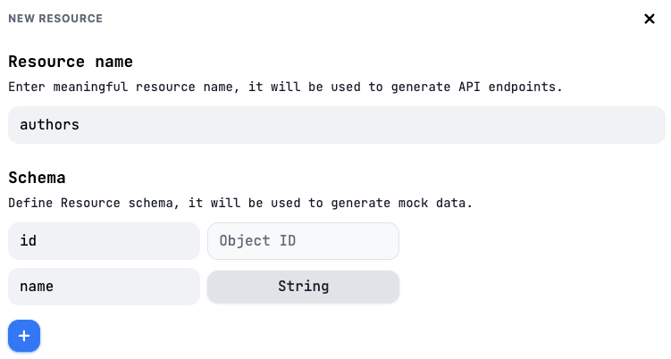
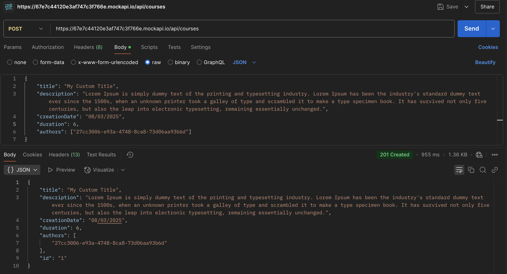

# Task 2. React Router. Asynchronous React.

## Task requirements

This task is the second part of the project, and your main goal is to learn and practice working with routing and asynchronous logic in React.

You will need to create Login, Course Form, Course Info and Courses pages.
You will need to add mock API for handling authorization and courses information.

#### Login Page requirements

- Route: /login.
- User should be redirected to Login page if he's not authorized.
- Login should have an auth functionality. When you entered an username and password application sends request to API using login service. You can use [Dummy JSON Auth API](https://dummyjson.com/docs/auth#auth-login). After successful login application navigates to Courses page
- Save token from API after login to localStorage. Add functionality that check if token in localStorage. If token is in the localStorage app automatically navigates to /courses route.
- Validation required for all fields (username and password)

#### Courses Page requirements

- Route: /courses.
- Show Courses component by default if there is token in the localStorage.
- Navigate to the route courses/add by clicking Add New Course button.

#### Course Info Page requirements

- Route: /courses/:courseId
- To find out which course info you should render on CourseInfo page, you should use id of the course from path-parameters.
- Back to course button should navigate to the route /courses.

#### Course Form Page requirements

- Route: /courses/add.
- Page should contain following fields:
  - Title (input) - field for input course name. Text length should be at least 2 characters.
  - Description (textarea) - text length should be at least 2 characters.
  - Authors - contains a list of all authors and their corresponding Add author buttons
  - Course authors - contains a list of authors course and their corresponding Delete author buttons
  - Delete author - when user clicks on this button the corresponding author disappears from the Course authors list and shows in Authors
  - Add author - when user clicks on this button the corresponding author disappears from the Authors list and shows in Course authors. New author should be added to the initial author's list
  - Author field (input) - author name length should be at least 2 characters;
  - Create author (button) - when user clicks on this button: the new author appears in Authors and input cleaned
  - Duration - this part provides logic for adding course duration time.
    - the duration of the course is entered in minutes;
    - for the correct display of the course duration, you need to format minutes into hours and minutes;
    - duration should be more than 0 minutes;
    - user should have an ability to enter ONLY numbers into the field.
  - Create course (button) - when user clicks on this button:
    - User is navigated to the route/courses;
    - New course is added to the courses list.
- After save course should appear in the Courses Page. 

### API requirements

- For login you can use [Dummy JSON Auth API](https://dummyjson.com/docs/auth#auth-login)
- You can use [Mock API](https://mockapi.io/) to create your Courses API:
  - Add two resources, courses and authors:

    
    
  - Add data from mockedCoursesList and mockedAuthorsList as initial data 
  - Use resulted API for all required requests: list all courses, create new course, list all authors, create new authors.

    

### Other requirements

- The header should contain: Logo component, User Name and Login/Logout button.
- When user clicks on Logout button, app should navigate to /login page and token should be removed from localStorage
- Cover with tests all pages (tests will be checked during mentor check)
- Create a separate branch for this task. Branch name: "react-task-2".
- All logical parts should be set into separate components and files.
- You can use CSS frameworks (e.g. Tailwind CSS) or React Ui library (e.g. Antd, Materia UI)

### Optional requirements (can be implemented, but not necessary)

- There may be a functional "delete" button in the authors list. It should remove the author from the general list only if no other course uses it. If the author is listed in multiple courses, the user should see a warning message stating that he cannot be deleted, along with the total number of courses and list of course names in which he was used.
- "Course Edit" Page can be implemented and should be placed by route `/courses/:courseId/edit`. It should have the same functionality as "Course Add" Page, but all inputs and block should be filled with course data.

**Cross-Check Criteria: 85 Points**:

1. Login Page (20 Points)
  - [5 points] Route and Redirect: Redirects non-authorized users to `/login`.  
  - [10 points] Authorization: Sends API request on login, saves token to `localStorage`, navigates to `/courses`, auto-redirect if token exists.  
  - [5 points] Validation: Validates email and password (required, proper format).  

2. Courses Page (15 Points)
  - [5 points] Route and View: Displays courses if token exists.  
  - [5 points] Add New Course Navigation: Navigates to `/courses/add` when clicking the button.  
  - [5 points] Course List: Fetches and displays title, description, authors, duration, and creation date.  

3. Course Info Page (10 Points)
  - [5 points] Route Matching: Renders course data with `courseId` from path.  
  - [5 points] Rendering and Navigation: Displays all course details, navigates back to `/courses`.  

4. Course Form Page (30 Points)
  - [5 points] Route & Navigation: Accessible at `/courses/add`, navigates from `Add New Course`.  
  - [15 points] Form Functionality:  
    - Title/Description: At least 2 characters.  
    - Duration field: Numeric, formatted as `hh:mm`, >0.  
    - Authors management (Add/Delete): Move authors between lists and create new authors (at least 2 characters).  
  - [10 points] Create Course: Saves course to API and navigates back to `/courses`.  

5. Header Component (10 Points)  
  - Includes `Logo`, `User Name`, and `Login/Logout` button. Logout removes token and navigates to `/login`.
